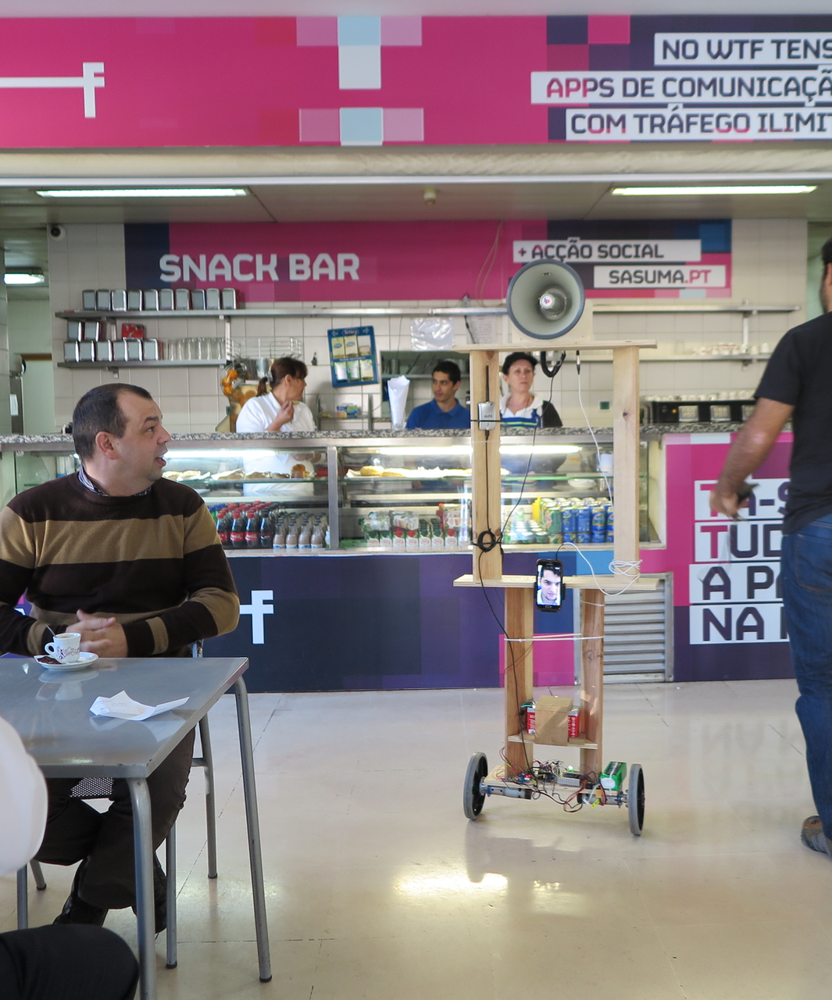

# ProBot - The Self Balancing Protest Robot

> “…Our leading bankers and merchants speak to their congeners through the length and breadth of the land in a second of time; their rich and subtle souls can defy all material impediment, whereas the souls of the poor are clogged and hampered by matter, which sticks fast about them as treacle to the wings of a fly, or as one struggling in a quicksand: their dull ears must take days or weeks to hear what another would tell them from a distance, instead of hearing it in a second as is done by the more highly organised classes.  Who shall deny that one who can tack on a special train to his identity, and go wheresoever he will whensoever he pleases, is more highly organised than he who, should he wish for the same power, might wish for the wings of a bird with an equal chance of getting them; and whose legs are his only means of locomotion?  That old philosophic enemy, matter, the inherently and essentially evil, still hangs about the neck of the poor and strangles him: but to the rich, matter is immaterial; the elaborate organisation of his extra-corporeal system has freed his soul.” 
> -Samuel Butler, [Erewhon, Book of the Machines](https://www.gutenberg.org/files/1906/1906-h/1906-h.htm), 1872

Most robotics technologies are first implemented in military applications, most of the rest for business. Following on a history of related work, Probots are inexpensive, human-sized protest robots. No one has lost money by replacing human labor with machines, efficient devils, so the unemployment has been rising, and newly graduated Spanish students that are out of work stay too much time drinking calimocho and protesting. The indignados are unorganized and inneficient! So it is time to automate them, send robots for protests, unemploying them twice.
	
Any protester can control the robot while sitting in the caffee or at their gardens anywhere in the work by simply using a web page to control it, but also watch, hear and speak through it.
	
That’s why we created a self-balancing robot, with a rigid sturdy frame, a megaphone on the top as a symbol of protest and also as a way to talk to people.
	
This robot is 1,60m (5’/3’’) tall that self-balances in 2 wheels, controlled by a Sabertooth 2X25A or Cytron 13A 5-25V Motor Controller. The brain of the operation is a Beaglebone Black with an MPU6050 accelerometer and gyroscope and also optical encoders on each motor.
	
A shield was created to organize the components. A 24V battery power-ups all the system.
	
The megaphone is a DH-12, that has a siren and a microphone, that we hacked and placed a wire to connect to a sound jack output, enabling us to connect the megaphone to almost any device (ex: cellphone, MP3 player, laptop, you name it).
	
The system can be controlled remotely through wifi, using a smartphone hotspot connected to 3G or 4G network. A web page was created with the possibility of viewing the status of the probot, where if available can be controlled. Each ProBot can be controled with a touch device (a smartphone or a tablet), with a gamepad or even with the keyboard.

Any person can build a ProBot by just following the instructions available on [instructubles](http://www.instructables.com/id/ProBot-the-Protesting-Robot/).

ProBot V1                  |  ProBot V2		       |  ProBot V2
:-------------------------:|:-------------------------:|:-------------------------:
  |    |  

   |
